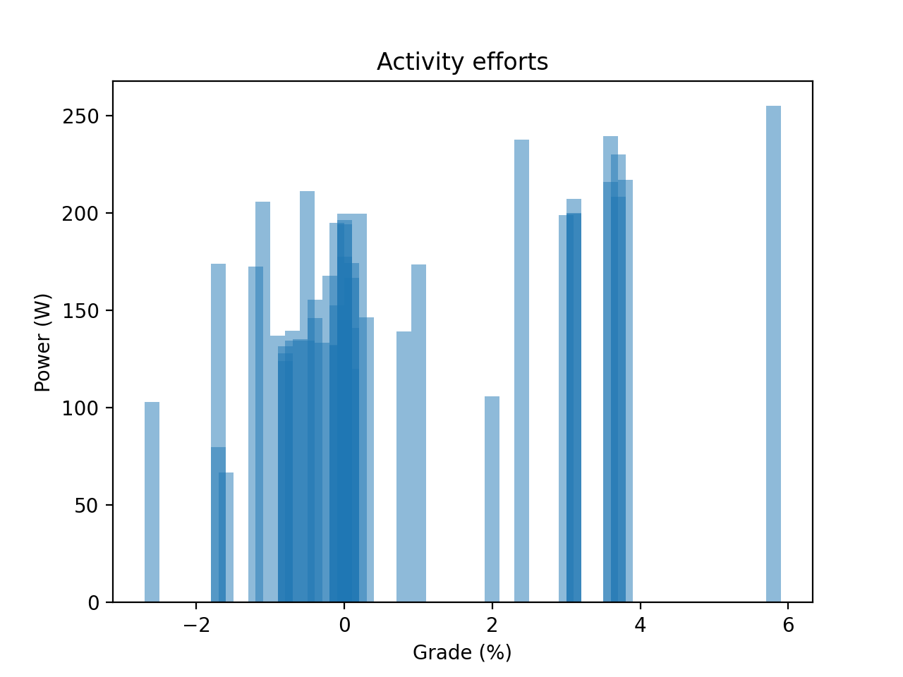

# Strava ride power graph - Part 1: API extract
This is the source code for The Newbie Cloud Architect blog post [#020](https://tncad.blogspot.com/2020/06/020-strava-ride-power-graph.html). 

## Description
The Python application collects Strava segment efforts from a given ride activity to analyse corresponding elevation grades and power metrics. Strava API authentication/extraction is done via Python stravalib, data visualization is done via Python Matplotlib.

## Results

