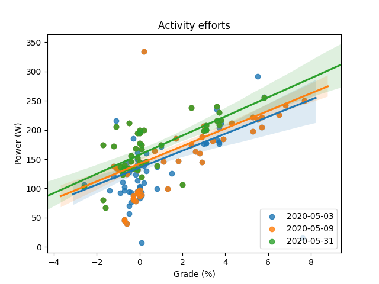

# Strava ride power graph - Part 2: Retry loop
This is the source code for The Newbie Cloud Architect blog post [#023](https://tncad.blogspot.com/2020/06/023-strava-ride-power-graph-part2.html). 

## Description
The Python application is based on previous [blog](https://tncad.blogspot.com/2020/06/020-strava-ride-power-graph.html) and [repository](https://github.com/tncad/life-hack/tree/master/020-strava-ride-power-graph) assets. It handles Strava API limitations for collecting full and multiple activity records. Data visualization is done via Seaborn module. 

## Results

