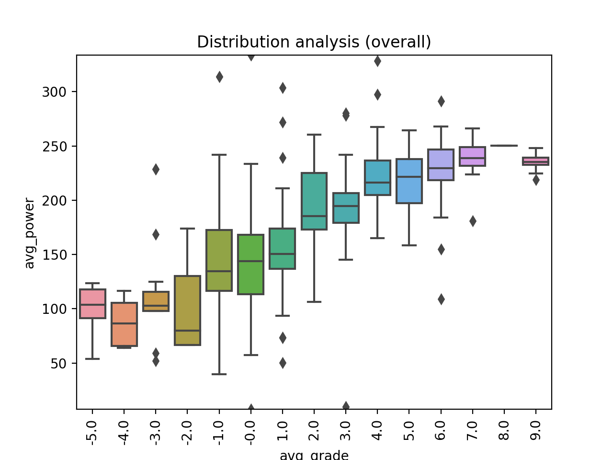
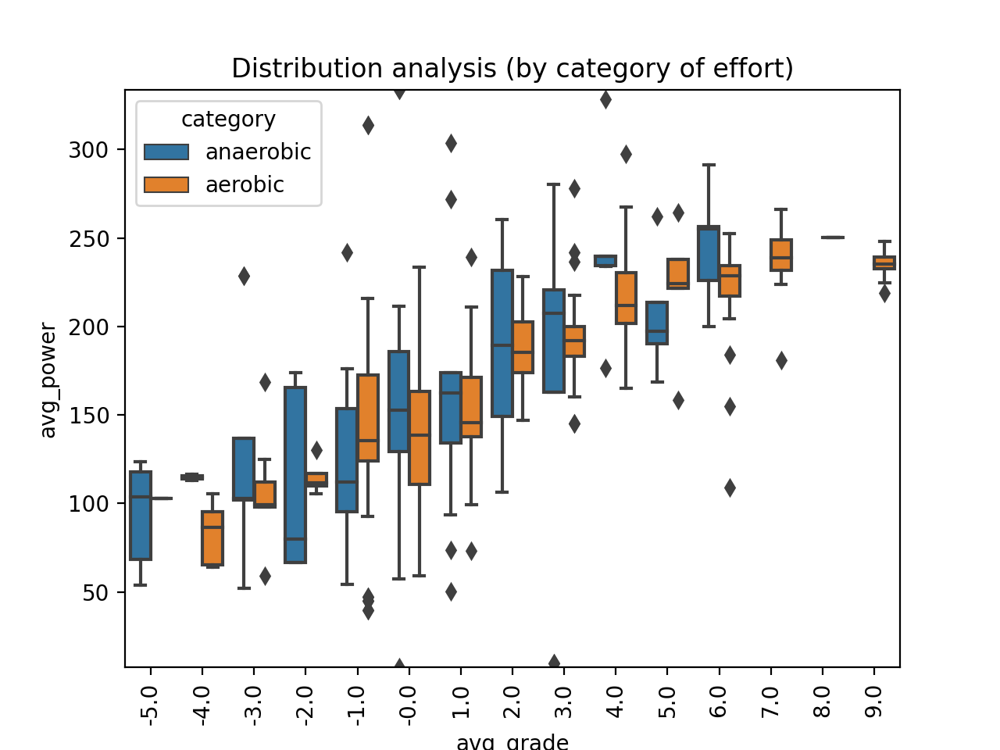
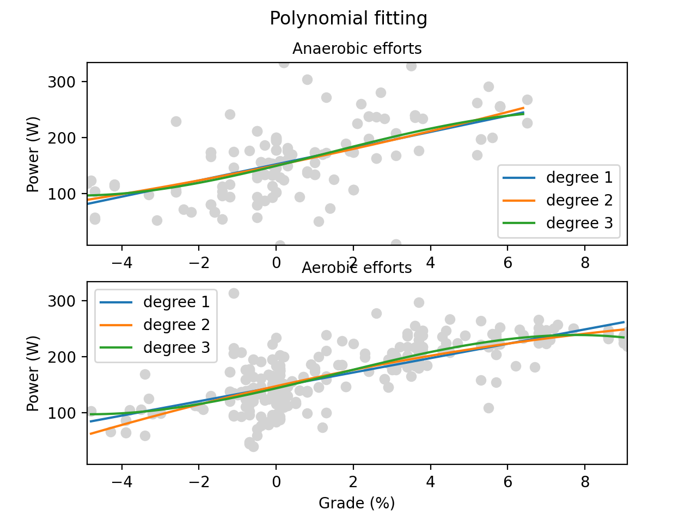

# Strava ride power graph - Part 3: Curve fitting
This is the source code for The Newbie Cloud Architect blog post [#037](). 

## Description
The Python application is based on previous [blog](https://tncad.blogspot.com/2020/06/023-strava-ride-power-graph-part2.html) and [repository](https://github.com/tncad/life-hack/tree/master/023-strava-ride-power-graph-part2) assets. It demonstrates mathematical patterns of ride efforts unsing Numpy module.

## Results

