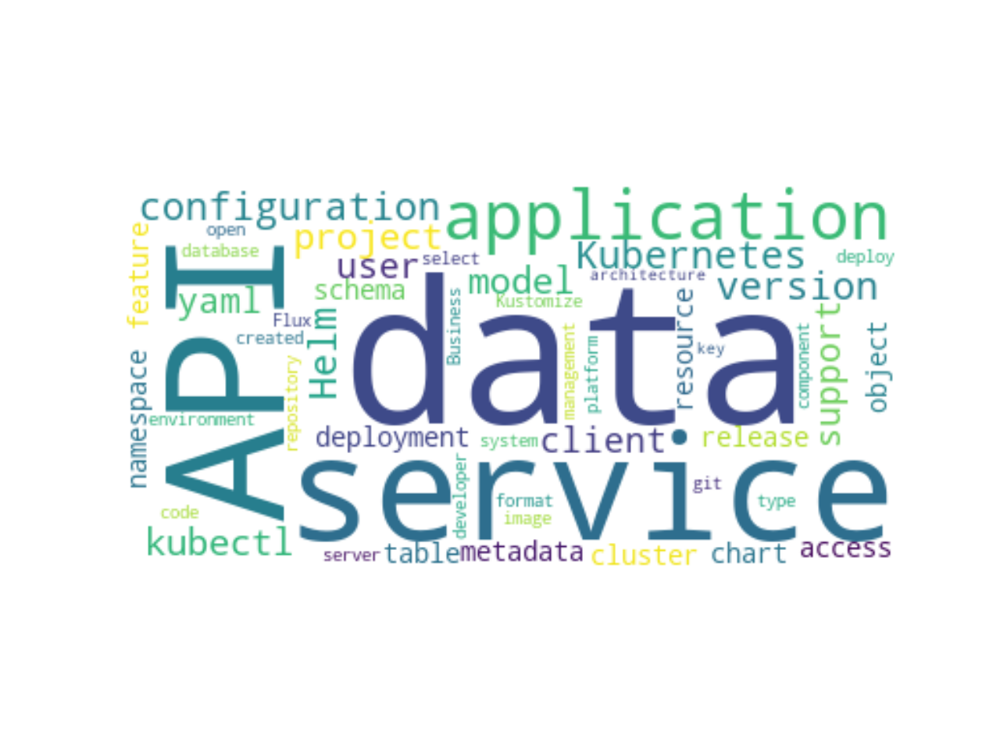

# Article writing with Blogger
This is the source code for The Newbie Cloud Architect blog post [#041](https://tncad.blogspot.com/2020/08/041-article-writing-with-google-blogger.html). 

## Description
The Python application connects to the Blogger API and retrieves blog post data relevant for self-analysis.

## Results

